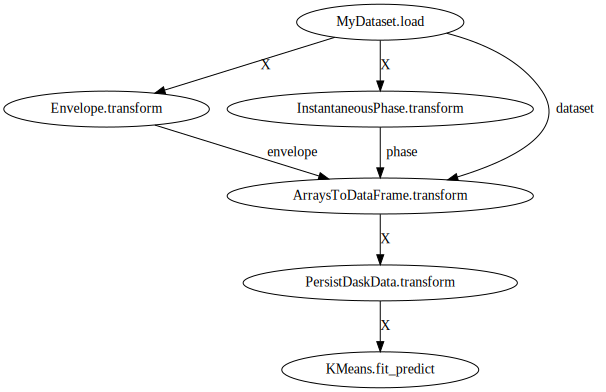

# DASF Seismic Lite

Este repositório contém uma implementação de referência para classificação de fácies sísmicas com o K-means usando o DASF. O *pipeline* de classificação é mostrado na figura abaixo [](./pipeline.svg)

Para permitir a extração de atributos sísmicos, uma versão leve do `dasf-seismic`, intitulada `dasf-seismic-lite`, é disponibilizada no diretório `dasf-seismic-lite`.

## Instalação

Para instalar o `dasf-seismic-lite`:

1. Clone o repositório do [`dasf-core`](https://github.com/discovery-unicamp/dasf-core) e crie uma imagem docker de cpu. Para isso, você pode executar os seguintes comandos (em uma pasta fora deste repositório), que irá gerar uma imagem docker chamada `dasf:cpu`:

```bash
git clone https://github.com/discovery-unicamp/dasf-core.git
CONTAINER_CMD=docker ./build_container.sh cpu
```

2. Clone este repositório e crie uma imagem docker que irá instalar o `dasf-seismic-lite`. Neste repositório, foi disponibilizado um script para facilitar a criação da imagem docker. Para isso, você pode executar os seguintes comandos (em uma pasta fora deste repositório), que irá gerar uma imagem docker chamada `dasf-seismic:cpu`:

```bash
./build_docker.sh
```

## Execução único nó

1. Dentro da pasta `data`, você deve colocar seus arquivos `npy` de treino ([`F3_train.npy`](https://drive.google.com/file/d/1N7r-6BsTW8HasiFVEzGnin2LxrRPfkjd/view?usp=drive_web&authuser=1)).

2. Execute o comando:
    
```bash
docker run -it -v $(pwd):$(pwd) -e HOME=$(pwd) -w $(pwd) --network=host dasf-seismic:cpu python3 reference.py --data data/F3_train.npy
```


## Execução multi-nós

1. Instancie um dask scheduler (o endereço do scheduler será mostrado no terminal, será algo semelhante a `tcp://192.168.1.164:8786`)

```bash
docker run -it -v $(pwd):$(pwd) -e HOME=$(pwd) -w $(pwd) --network=host dasf-seismic:cpu dask scheduler
```

2. Instancie um dask worker e conecte-o ao shceduler criado no passo anterior (substitua `<scheduler_address>` pelo endereço do scheduler, será algo semelhante a `tcp://192.168.1.164:8786`)

```bash
docker run -it -v $(pwd):$(pwd) -e HOME=$(pwd) -w $(pwd) --network=host dasf-seismic:cpu dask worker <scheduler_address>
```

3. Execute a implementação de referencia passando o endereço do scheduler para a flag `--address` (substitua `<scheduler_address>` pelo endereço do scheduler, será algo semelhante a `tcp://192.168.1.164:8786`)

```bash
docker run -it -v $(pwd):$(pwd) -e HOME=$(pwd) -w $(pwd) --network=host dasf-seismic:cpu python3 reference.py --data data/F3_train.npy --address <scheduler_address>
```

**NOTA**: Lembre-se de executar os comandos acima na pasta raiz deste repositório.